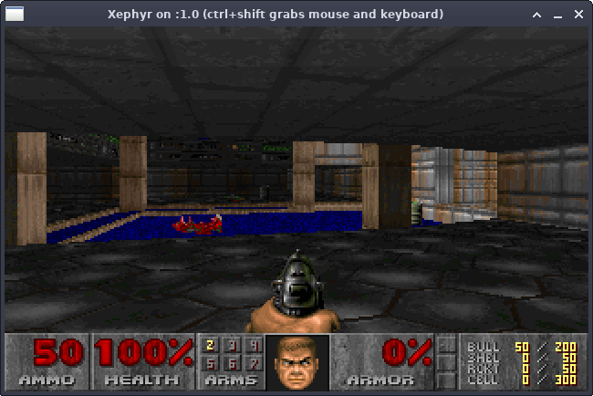

# DOOM (my fork)

This is a bare bones 32-bit linux fork of the original DOOM source code. The point of this fork is to apply as minimal changes as possible to run the game on modern 32-bit linux (Debian 11). This git repository includes shareware DOOM1.WAD



## Requirements

- X11 PseudoColor display
  - Xephyr
  - Xnest
  - xinit
- /dev/pcm
  - ALSA OssEmulation (snd-pcm-oss)
- 32-bit libraries to link against

## TODO

- Mouse does not work
- Music does not work

## Compiling the game

```bash
make
```

## Running the game

The original linux DOOM uses /dev/pcm as a output sound device, this is not supported in modern Linux kernels. Thus we must emulate /dev/pcm to make the device available.

The original linux DOOM uses an 8-bit 320x200 screen, modern X11 does not support this out-of-box but a simulated window can be created with a different DISPLAY ID.

```bash
# enable ALSA pcm oss sound emulation
sudo modprobe snd-pcm-oss
# enable X11 640x400 256-color display emulation
Xephyr :1 -ac -screen 640x400x8
# run the game in DISPLAY 1
DISPLAY=:1 ./linuxxdoom
```
